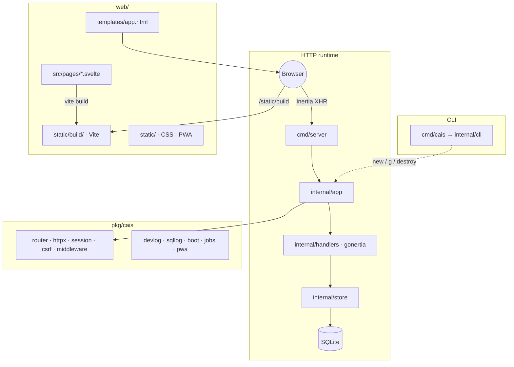

# Go on Cais


Full-stack Go framework for mini apps (Lightsail-friendly): **Inertia.js + Svelte 5**, Tailwind, and SQLite — with a Rails-style CLI.

## Stack

| Layer     | Choice                                                                       |
| --------- | ---------------------------------------------------------------------------- |
| Language  | Go 1.26 (`net/http` stdlib; see `go.mod`)                                    |
| Frontend  | **Inertia.js + Svelte 5** (`@inertiajs/svelte` + Vite → `web/static/build/`) |
| CSS       | Tailwind CSS 3.x                                                             |
| DB        | SQLite (`modernc.org/sqlite`, no CGO)                                        |
| PWA       | Manifest, service worker, offline page, icons, fullscreen                    |
| Meta      | Open Graph / Twitter via `pkg/cais/meta`                                     |
| Legacy UI | HTMX helpers in `pkg/cais/` for `cais g resource` / chat until ported        |

## Quick start

```bash
export PATH="$HOME/go/bin:$PATH"
make install-cli          # installs cais
cais new myapp
cd myapp && cais install && cais dev   # http://localhost:8080
```

**This dogfood repo** (framework + demo app):

```bash
export PATH="$HOME/go/bin:$PATH"
make pwa                  # regenerate PWA assets if needed
make dev                  # air + Tailwind watch + vite build --watch
make test                 # go test ./... -race
make ci                   # test + js-test + lint + format-check
```

Demo login (dev seed): `demo@example.com` / `password`.

## CLI (Rails-style)

```bash
make install-cli
export PATH="$HOME/go/bin:$PATH"
```

| Command                                                                                        | Description                                                                              |
| ---------------------------------------------------------------------------------------------- | ---------------------------------------------------------------------------------------- |
| `cais new <app> [dir] [--minimal\|--blank] [--module path]`                                    | Scaffold app (Inertia + Svelte by default)                                               |
| `cais g [--dry-run] handler\|page\|resource\|model\|migration\|auth\|console\|ci\|job\|stream` | Generators                                                                               |
| `cais destroy [--dry-run] resource\|handler\|model\|auth\|migration`                           | Undo generators                                                                          |
| `cais install`                                                                                 | `npm install` + `go mod tidy`                                                            |
| `cais dev`                                                                                     | **air + Tailwind watch + `vite build --watch`** (Svelte rebuilds on `web/src/**` change) |
| `cais css` / `cais build` / `cais server` / `cais test`                                        | CSS, binary, run, tests                                                                  |
| `cais console`                                                                                 | REPL (store, cfg, db + SQL)                                                              |
| `cais routes [--verbose]`                                                                      | List routes from `internal/app/routes.go`                                                |
| `cais db migrate\|status\|rollback\|prune-sessions\|seed`                                      | Migrations & seeds                                                                       |
| `cais jobs work\|status`                                                                       | SQLite background jobs                                                                   |
| `cais doctor [--mobile]`                                                                       | Verify Inertia/Vite, PWA, mobile SSE, SW cache strategy                                  |
| `cais pwa [--bump]`                                                                            | Write/refresh PWA assets; **migrates** `sw.js` to network-first SPA; `--bump` cache      |
| `cais link [path] [--unlink]`                                                                  | Local `go.mod replace` for framework dev                                                 |
| `cais version`                                                                                 | Framework version                                                                        |

Field types for generators: `string`, `text`, `url`, `bool`, `int`, `date`, `references` (or `name:belongs_to`). Suffix `?` for optional.

```bash
cais g resource bookmark --fields title:string,url:url,notes:text? --public --paginate
cais g handler settings   # Go handler + test + web/src/pages/Settings.svelte
```

## Development experience

- **Port auto-pick** if `:8080` is busy
- **Boot banner** with LAN URLs for phone testing on Wi‑Fi
- **Logs** — JSON request (`kind: request`) + SQL (`kind: sql`); `LOG_FORMAT=text` for plain text
- **`/logs`** — localhost-only HTMX log viewer in development
- **Frontend** — `cais dev` rebuilds Vite assets when Svelte sources change (no manual `npm run build` for day-to-day UI work)
- **PWA** — SW is **network-first** for `/static/build/` and `/static/css/` so SPA bundles stay fresh; `cais pwa --bump` after HTML/template changes on phones

## Structure



```
pkg/cais/              framework packages (see AGENTS.md table)
internal/cli/          cais CLI + scaffold templates (split by domain)
internal/app/          dogfood bootstrap + routes
internal/handlers/     Inertia handlers (+ HTMX fallbacks where needed)
internal/store/        SQLite + migrations
web/templates/app.html Inertia root shell
web/src/pages/         Svelte 5 pages
web/static/build/      Vite production output (gitignored; CI builds it)
cmd/server/            entry point
cmd/cais/              CLI entry point
```

## Inertia + Svelte

Handlers render components via gonertia:

```go
_ = h.inertia.Render(w, r, "Login", inertia.Props{
  "site": meta.ForRequest(h.site, r),
})
// Validation: inertia.SetValidationErrors → re-render same component
// Flash redirect: inertia.SetFlash + h.inertia.Redirect(..., 303)
```

Svelte pages use `useForm` as a **reactive object** (not a store — no `$form`):

```svelte
<script>
  import { useForm, router } from '@inertiajs/svelte'
  let form = useForm({ email: '', password: '' })
  function submit() { form.post('/login') }
  function logout() { router.post('/logout') }  // use:inertia is for GET only
</script>
```

**Svelte 5 footgun:** do not push Inertia props into the form via reactive statements (`$: form.item_id = items[0].id`). That can blank the page. Prefer local state for derived UI and set form fields on submit (or `bind:value` for fields the user edits). Never re-create `useForm(...)` inside a reactive block.

Entry (`web/src/main.js`): Svelte 5 `mount()`, CSRF wired to Cais cookies:

```js
createInertiaApp({
  // ...
  setup({ el, App, props }) {
    mount(App, { target: el, props });
  },
  http: {
    xsrfCookieName: "cais_csrf",
    xsrfHeaderName: "X-CSRF-Token",
  },
});
```

**JSON bodies** — Inertia posts `application/json`. Handlers should use:

```go
if err := httpx.ParseFormOrJSON(r); err != nil { /* ... */ }
email := r.FormValue("email")
```

## Framework APIs (highlights)

**Router**

```go
r.Get("/blog/{slug}", cais.StringParam("slug", blog.Show))
r.Group(middleware.RequireAuth("/login"), func(g *cais.Router) {
  g.Get("/dashboard", dashboard.ServeHTTP)
})
```

**httpx** — `RenderOrError`, `WritePage`, `SeeOther`, `ParseFormOrJSON`, `FormTruthy`, ETag helpers.

**Sessions** — cookie auth (7-day TTL), `session.SignIn` / `SignOut`, `cais db prune-sessions`.

**CSRF** — double-submit cookie `cais_csrf` + form field / `X-CSRF-Token`.

**Jobs** — SQLite queue, no Redis:

```bash
cais g job send_welcome --cron "0 3 * * *"
cais jobs work --concurrency 2
```

**Security** — `SecurityHeaders` (CSP includes `font-src 'self' data:`; extend with env), rate limiters on login/contact, `ADMIN_TOKEN` required in production.

## Environment variables

| Variable                                            | Default          | Description                                             |
| --------------------------------------------------- | ---------------- | ------------------------------------------------------- |
| `PORT`                                              | `:8080`          | Listen address                                          |
| `DB_PATH`                                           | `./data/app.db`  | SQLite path                                             |
| `ENV`                                               | `development`    | `development` / `production`                            |
| `APP_URL`                                           | _(empty)_        | Public URL for OG tags (**required in production**)     |
| `ADMIN_TOKEN`                                       | _(empty)_        | Bearer admin (**required in production**)               |
| `LOCALE`                                            | `en`             | `en` or `pt`                                            |
| `LOG_FORMAT`                                        | _(auto)_         | `json` or `text`                                        |
| `TRUSTED_PROXIES`                                   | _(empty)_        | Comma-separated IPs for `X-Forwarded-For`               |
| `CSP_STYLE_SRC`                                     | _(empty)_        | Extra style hosts (e.g. `https://fonts.googleapis.com`) |
| `CSP_FONT_SRC`                                      | _(empty)_        | Extra font hosts (e.g. `https://fonts.gstatic.com`)     |
| `CSP_CONNECT_SRC` / `CSP_MEDIA_SRC` / `CSP_IMG_SRC` | _(env-specific)_ | Other CSP extras                                        |
| `STATIC_DIR` / `TEMPLATES_DIR`                      | _(cwd-relative)_ | Override when deploy cwd ≠ app root                     |
| `CAIS_REPLACE` / `CAIS_SKIP_TIDY`                   | _(empty)_        | Scaffold/local framework dev                            |

## CI and quality

```bash
make pre-commit-install   # once
make ci                   # go test -race + js-test + lint + prettier
```

GitHub Actions: `npm ci && npm run build`, then Go tests, golangci-lint, Prettier, scaffold + production smoke.

## Deploy (Lightsail / systemd)

```bash
npm run build   # Vite → web/static/build/
cais build --os linux --arch amd64 -o bin/server-linux
tar czf release.tar.gz bin/server-linux web/static
```

- Guide: [`docs/deploy/lightsail-systemd.md`](docs/deploy/lightsail-systemd.md)
- Unit template: [`deploy/systemd/cais-app.service.example`](deploy/systemd/cais-app.service.example)
- Health: `GET /health` → `{"status":"ok", "lan_urls":[...]}` (503 `degraded` if DB is down)

Docker:

```bash
make docker
docker run -p 8080:8080 -v cais-data:/app/data cais:latest
```

## Upgrade CLI (agents & global install)

Published tags matter: `go install …@latest` follows **tags**, not `main`.

```bash
go install github.com/puppe1990/cais/cmd/cais@v0.8.1
# or after newer releases:
# go install github.com/puppe1990/cais/cmd/cais@latest
cais version
cais doctor          # warns if CLI is older than go.mod
cais pwa             # migrate legacy cache-first SW on existing apps
```

If `cais version` is older than your app’s `go.mod` require (or predates Vite watch), `cais doctor` / `cais dev` print a fix hint.

## AI-assisted development

See **[AGENTS.md](AGENTS.md)** for:

- Mandatory TDD
- Clean Code for Agents (file size, greppable names, headless tests)
- Inertia/Svelte conventions and generator layout
- Mobile / PWA / SSE checklists

## License

See [LICENSE](LICENSE).
